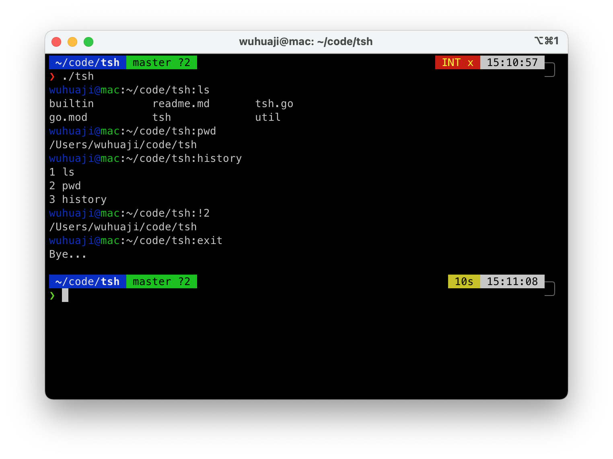

### tsh - alias for TinyShell

tsh，**又**一个简单的shell，go语言实现。主要为了练习go语言和系统编程，挖坑中……

### 使用：
- 编译：`go build *.go`
- 运行：`./tsh`
- 退出：exit

### 支持特性：
- 管道
- 重定向
- 实现内置命令(builtins)
  - cd
  - history
  - pwd

### 计划实现的特性：
- [ ] 后台进程
- [ ] 信号发送及 kill 
- [ ] 环境变量及export
- [ ] alias
- [ ] 配置文件：.tshrc